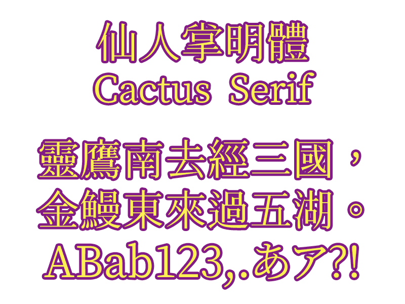
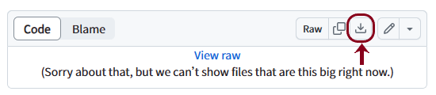

# 🌕仙人掌明體 Cactus Classical Serif

## 🌕提要

「仙人掌明體（Cactus Classical Serif）」爲適用於繁體中文環境的開源字型，主要製作者爲田海東，宇文滿月參與製作及維護。它以[Henry Chan開發的「香港民間字集傳承字形版」字型](https://github.com/hfhchan/hkcs)及其於[字形維基（Glyphwiki）](https://glyphwiki.org/wiki/User:hkcs)登錄的字圖爲基礎，並以[But Ko基於「思源字型」開發的「源樣明體」字型](https://github.com/ButTaiwan/genyo-font/)補充西文及其他字符，局部參考傳承字形，包括[傳承字形標準化文件](https://github.com/ichitenfont/inheritedglyphs)的推薦形體，與其他常見的傳承字形，把字形修改爲中文傳統的形體，並補製一些欠缺的漢字。

## 🌕下載

目前最新版本爲1.000版，發佈於2024年4月23日。

🌕 [仙人掌明體 Cactus Classical Serif 下載](fonts/CactusClassicalSerif.ttf) 🌕

下載方法：點進連結後，按「View raw」欄右上方的「Download raw file」（如下圖紅圈所示）。

另有特殊版本「簡繁轉換版」，收錄字數較少，方便把簡體文件顯示成繁體中文。但它包含的字符都比較少，請確定有必要才使用它。此版本以[GuiWonder開發的「中文字型簡繁處理工具」](https://github.com/GuiWonder/TCFontCreator)製作。

🌕 [仙人掌明體（簡轉轉換） Cactus Serif Sim-to-Trad 下載](fonts/CactusSerifSimtoTrad.ttf) 🌕

## 🌕製作說明

本字型由Henry Chan繪製主要字圖，田海東主力製作，宇文滿月參與修改，以應付屏顯和排印之需。

礙於人力、時間等限制，本字型尚有不少地方有待高賢不吝賜正，敬祈見諒。

## 🌕聯絡滿月
關於本字型的問題，可以在本專案的[issue](https://github.com/MoonlitOwen/CactusSerif/issues)上提出。

滿月自己是VTuber，平日活躍於YouTube和社交媒體，歡迎瀏覽滿月的連結集：[http://lit.link/moonlitowen](http://lit.link/moonlitowen)，訂閱[滿月的YouTube頻道](https://www.youtube.com/@moonlitowen)和追蹤滿月的社交媒體💛💜

## 🌕鳴謝
* [傳承字形標準化文件](https://github.com/ichitenfont/inheritedglyphs)
* [一點字坊（I.字坊 I.Font Project）](https://github.com/ichitenfont)
* [香港民間字集](https://github.com/hfhchan/hkcs)
* [字形維基（Glyphwiki）](https://glyphwiki.org/wiki/User:hkcs)
* [一點明體（I.明體 I.Ming）](https://github.com/ichitenfont/I.Ming)
* [源樣明體（GenYoMin）](https://github.com/ButTaiwan/genyo-font/)
* [思源宋體（Source Han Serif /Noto Serif CJK）的日文和韓文版](https://github.com/adobe-fonts/source-han-serif/)
* [中文字型簡繁處理工具（TC Font Creator）](https://github.com/GuiWonder/TCFontCreator)
* [繁媛明朝（Fan Wun Ming）](https://github.com/ayaka14732/FanWunMing)